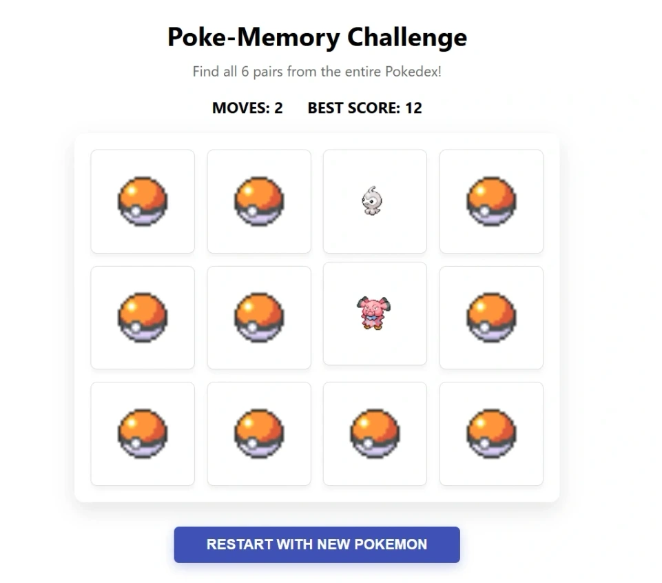

# memory-game

React • Vite • Emotion • PokeAPI App

---

[See The Project](https://akmemorygameak.netlify.app/)

---



---

Bu proje, her seferinde tüm Pokedex içerisinden rastgele seçilen 6 farklı Pokemon çiftini (toplam 12 kart) eşleştirmeye dayalı, dinamik ve eğlenceli bir hafıza oyunudur. Kullanıcıların en düşük hamle sayısıyla oyunu bitirerek kendi rekorlarını kırmaları hedeflenir.

### 🚀 Özellikler

- **Dinamik Kart Havuzu:** Sayfa her yenilendiğinde veya "Restart" butonuna tıklandığında, PokeAPI verileri kullanılarak 1000'den fazla Pokemon arasından tamamen rastgele 6 yeni çift seçilir.
- **Skor ve Rekor Sistemi:** Yapılan her iki kartlık deneme "MOVES" sayacını artırır. Oyun tamamlandığında, eğer mevcut hamle sayısı en iyi skordan düşükse bu değer `localStorage` üzerine kaydedilir ve "BEST SCORE" olarak görüntülenir.
- **Modern Responsive Tasarım:** `Emotion` kullanılarak oluşturulan 4x3 grid yapısı, mobil ve masaüstü cihazlara tam uyumlu şekilde tasarlanmıştır.
- **Performanslı Durum Yönetimi:** React Hooks (`useState`) kullanılarak, gereksiz render işlemlerinden kaçınılmış ve oyun mantığı modern standartlara göre optimize edilmiştir.

### 🛠️ Teknoloji Yığını

- **Frontend:** React (Vite)
- **Styling:** Emotion (@emotion/styled & @emotion/react)
- **Veri Kaynağı:** PokeAPI (Pokemon Sprites)
- **Paket Yöneticisi:** Yarn

### 📋 Gereksinimler

- Node.js (v18+)
- Yarn (v1.22+)

### 🔧 Kurulum ve Çalıştırma

```bash
# Projeyi klonlayın
git clone https://github.com/alperenkursun/memory-game

# Proje klasörüne gidin
cd memory-game

# Gerekli paketleri (node_modules) yükleyin
yarn install

# Uygulamayı başlatın (Geliştirici ortamı)
yarn dev
```

---

[Frontend Web Development Projeleri](https://academy.patika.dev/courses/frontend-web-development-projeleri/hafiza-oyunu)

[Patika Profile](https://academy.patika.dev/tr/@alpk)